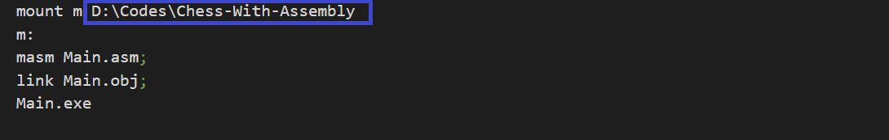
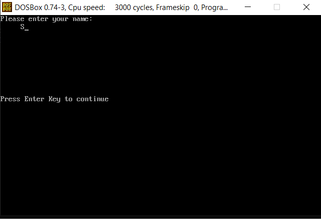
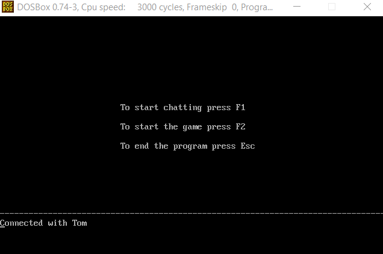
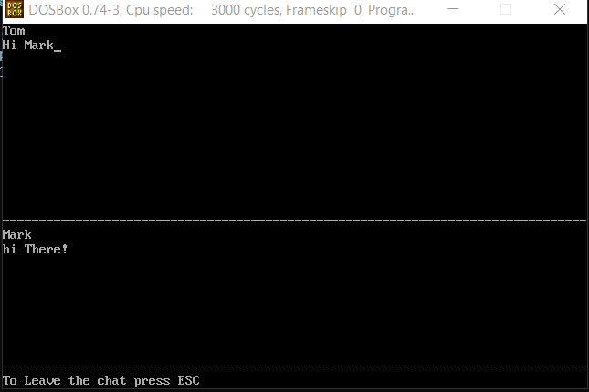
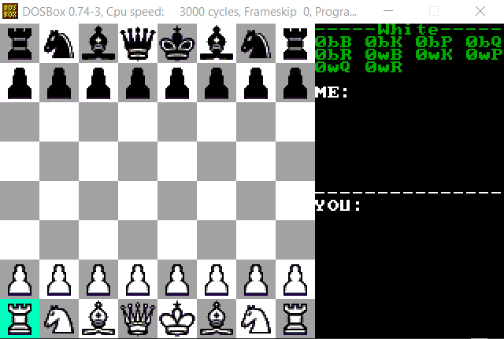

# Real-time Chess Game and Chatting System with Assembly Language
- A two-player real-time chess game and chatting system implemented in Assembly language. The game is like standard chess, with each piece moving exactly like standard chess. The only difference is that there are no turns, which means one player can move multiple pieces while the other player does not move any pieces. There is a 3 seconds countdown for each piece to be moved again. There is no checkmate and the game ends when the king is eaten. The two PCs are connected through the serial port and use serial communication to exchange information.

## Features
- Connect 2 PCs through a Simple network, using serial communication
- Chatting between two players
- Two-player real-time chess game
- Inline chatting during playing chess

## Requirements
- DOSBOX
- Serial port connector to connect both PCs (ex: [Serial to Ethernet Connector ](https://www.serial-over-ethernet.com/))

## How to run
- The program requires two PCs connected through a serial port.
- In `singleChess.conf`,`Chess-COM1.conf`and `Chess-COM2.conf` change the directory to your current directory.

- To open the program you can either:
    - Run `RunSingle.bat` on both PCs.
    - Run `RunMulti.bat` on one PC if you would like to open both screens on the same PC to try it.
- The user must enter a username that starts with a letter and is not more than 15 characters long. 

- After both users have entered their names, the main screen will appear, showing a list of available functionalities and how to navigate to each of them.

## Chatting
- To start chatting, both users press F1 to start chatting. The screen is divided into two halves, with the first half showing data written by the current user and the second half showing data sent by the second user.

## Real-time Chess Game
- To start the chess game, both users press F2 to start the game. The game takes up the whole screen, leaving the right part of the screen for inline chatting and notifications.

### Notification Bar
- The top right part of the screen shows the color assignment of the user (black or white), which player won the game (black or white) and the eaten pieces during the game.
- The abbreviations of the eaten pieces are:
    - Black Bishop (bB)
    - Black Knight (bK)
    - Black Pawn (bP)
    - Black Queen (bQ)
    - Black Rook (bR)
    - White Bishop (wB)
    - White Knight (wK)
    - White Pawn (wP)
    - White Queen (wQ)
    - White Rook (wR)

